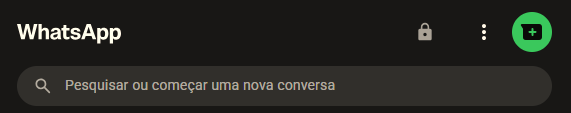
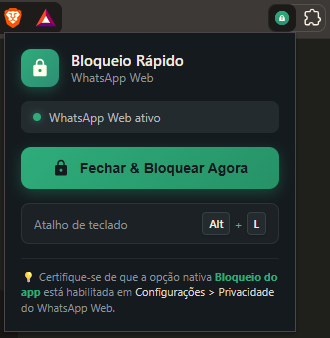

# WhatsApp Web - Bloqueio Rápido 🔒

<p align="center">
  
</p>

<p align="center">
  <a href="https://github.com/WSTym/wa-lock/releases/latest"></a>
  <a href="https://github.com/WSTym/wa-lock/blob/main/LICENSE"></a>
  <a href="https://brave.com"></a>
  <a href="https://www.google.com/chrome/"></a>
  <a href="https://web.whatsapp.com"></a>
  <a href="https://github.com/WSTym/wa-lock/pulls"></a>
</p>

<p align="center">
  <b>🇧🇷 Português</b> • 
  <a href="README.en.md">🇺🇸 English</a>
</p>

---

Extensão leve e prática para o **Brave, Google Chrome e navegadores baseados em Chromium** que une duas ações de segurança em um único clique ou atalho: **fecha a conversa aberta** e aciona o **Bloqueio do App** nativo do [WhatsApp Web](https://web.whatsapp.com).

---

## 📸 Demonstração

### 1. Botão Integrado na Barra do WhatsApp Web
<p align="center">
  
</p>

> O ícone de cadeado 🔒 se integra perfeitamente à barra superior do WhatsApp Web, mantendo o mesmo estilo visual, dimensões e comportamento nativo.

<br>

### 2. Interface Popup & Atalho no Navegador (Brave / Chrome)
<p align="center">
  
</p>

> Acesso rápido através do ícone da extensão fixado na barra do navegador, com detecção automática do WhatsApp Web e botão de bloqueio imediato.

---

## 🚀 Funcionalidades

- **⚡ Ação Dupla em 1 Clique:**
  - Fecha a conversa ativa (retornando à tela neutra sem conversas expostas).
  - Bloqueia o WhatsApp Web exigindo a senha/PIN para exibir as mensagens e contatos.
- **🔒 Botão Nativo Integrado:**
  - Adiciona um botão com ícone de cadeado na barra de ferramentas superior do WhatsApp Web, perfeitamente alinhado na mesma linha horizontal dos demais botões.
- **⌨️ Atalho de Teclado Rápido:**
  - Pressione **`Alt + L`** em qualquer momento para fechar e bloquear imediatamente.
- **🪟 Menu Popup no Navegador:**
  - Clique no ícone da extensão no navegador para verificar o status e bloquear remotamente.
- **👻 Execução Transparente (*Stealth*):**
  - O fluxo de menus do WhatsApp ocorre de forma imperceptível, sem menus piscando na tela.
- **🌐 Ampla Compatibilidade:**
  - Compatível com **Brave**, **Google Chrome**, **Microsoft Edge**, **Opera**, **Vivaldi** e qualquer navegador com suporte a extensões Chromium (Manifest V3).

---

## 📦 Como Instalar

### Opção A: Download Direto (Sem Git)
1. Baixe o arquivo **`wa-lock-v1.0.0.zip`** na página de **[Releases](https://github.com/WSTym/wa-lock/releases/latest)**.
2. Descompacte o arquivo ZIP em uma pasta do seu computador.
3. No seu navegador, acesse a página de extensões:
   - **Brave:** `brave://extensions/`
   - **Chrome:** `chrome://extensions/`
   - **Edge:** `edge://extensions/`
4. Ative a chave **Modo do desenvolvedor** (*Developer mode*) no canto superior direito.
5. Clique em **Carregar sem compactação** (*Load unpacked*) e selecione a pasta descompactada.

### Opção B: Via Git
```bash
git clone https://github.com/WSTym/wa-lock.git
```
Em seguida, carregue a pasta clonada na página de extensões do seu navegador.

---

## ⚙️ Pré-requisito no WhatsApp Web

Para que a função de **Bloqueio do app** funcione, a proteção nativa por senha deve estar habilitada:

1. Acesse o [WhatsApp Web](https://web.whatsapp.com).
2. Clique no menu de **3 pontinhos** no canto superior esquerdo > **Configurações**.
3. Acesse **Privacidade** > **Bloqueio de tela** (ou *Bloqueio do app*).
4. Ative a funcionalidade e defina sua senha.

---

## 🎯 Formas de Uso

| Método | Ação |
| :--- | :--- |
| **Botão na Barra** | Clique no ícone de cadeado 🔒 inserido na barra superior do WhatsApp Web. |
| **Atalho de Teclado** | Pressione `Alt + L` na página do WhatsApp. |
| **Popup da Extensão** | Clique no ícone da extensão no navegador e aperte **Fechar & Bloquear Agora**. |

---

## 📄 Licença

Este projeto está sob a licença [MIT](LICENSE) © 2026 [WSTym](https://github.com/WSTym).
